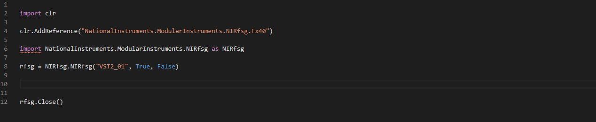

# rfmx-pythonnet

## Code Autocompletion
Stubs have been created with [ironstubs](https://github.com/gtalarico/ironpython-stubs) to enable code autocompletion.

To enable this feature, [configure your editor](https://github.com/gtalarico/ironpython-stubs/wiki) to use the stubs located in the [stubs](https://github.com/NISystemsEngineering/rfmx-pythonnet/tree/master/stubs/) directory.
If you are using Visual Studio Code, a [settings file](https://github.com/NISystemsEngineering/rfmx-pythonnet/tree/master/.vscode) has already been provided. To use it, clone this repo then open the folder in VS Code. 