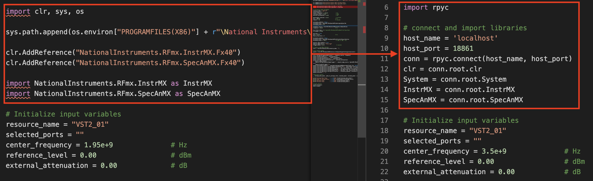
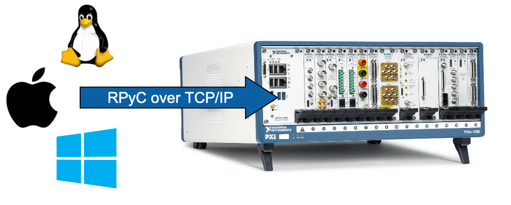
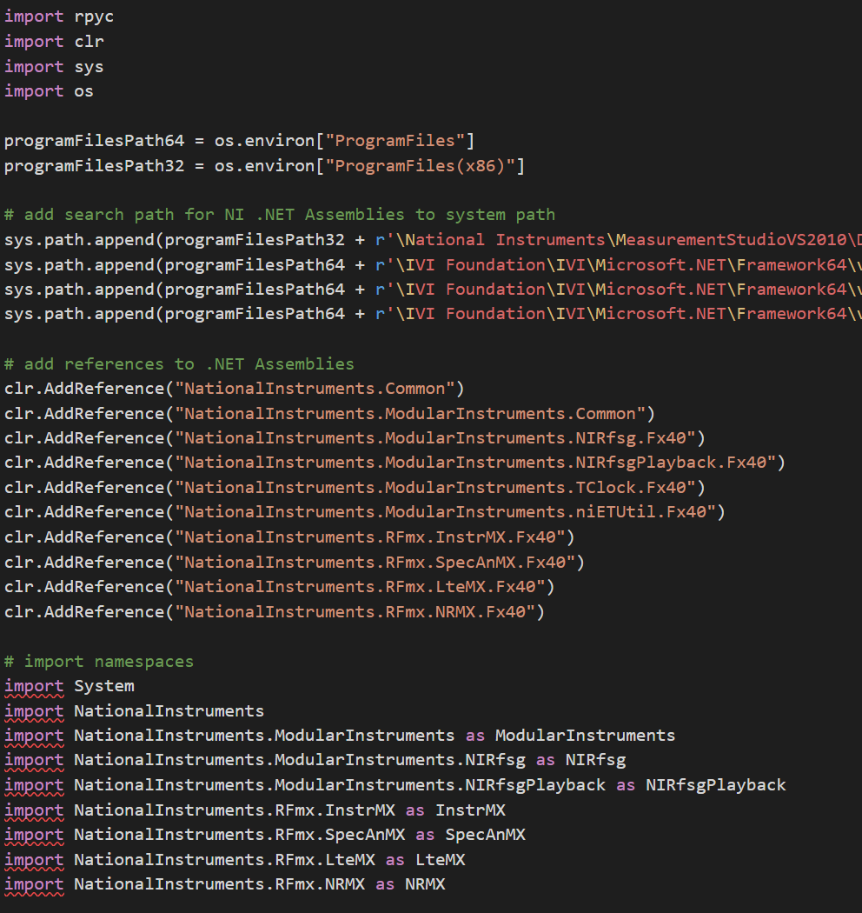
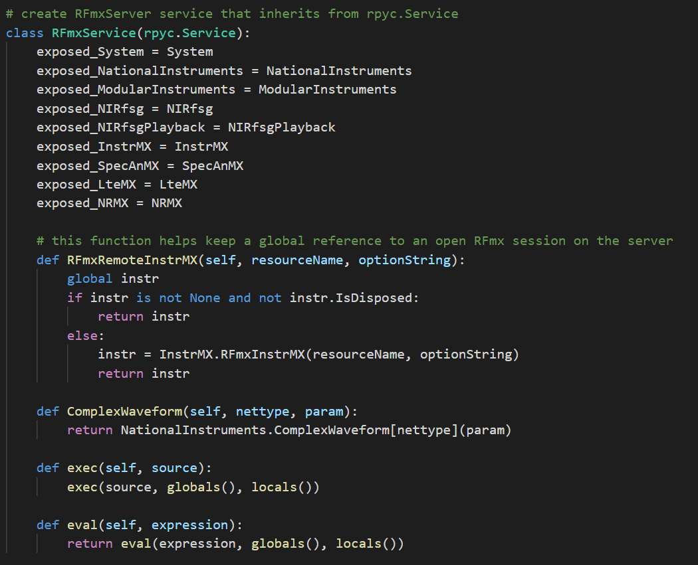
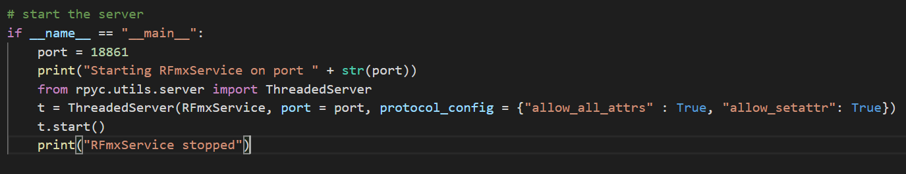
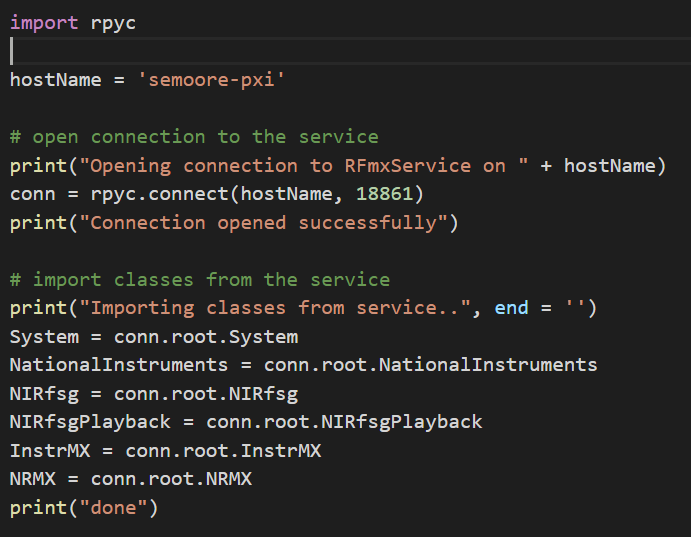

# Introduction
This project is an example of using [RPyC](https://rpyc.readthedocs.io/en/latest/) to make measurements in Python by calling into an RPyC server hosting NI software such as NI-RFmx and NI-RFSG.

# Demo Videos
[Click here to be redirected to YouTube](https://www.youtube.com/playlist?list=PLbtY6u-1ausYmZ_Sl47s6N2L9jWG4_aEm)

# Managing RFmxInstrMX Sessions
If the client opens an RFmxInstrMX session and terminates without closing it,
the session will remain alive on the server and subsequent calls to the RFmxInstrMX constructor 
(using the same resource name) will throw an exception. To obtain a reference to an existing 
session on the server, use the `RFmxInstrMX.GetSession(string resourceName, string optionString)` 
static method. This method gets a session, if it exists for the given resource name; else, it returns
a new one. To close a session that has been obtained multiple times, use the 
`RFmxInstrMX.ForceClose()` instance method. This method will destroy the session irrespective of how 
many references have been obtained to it.

# Adapting Local Examples for Remote Execution
All of the local examples in the [root/examples](../examples/) directory can be quickly adapted for remote execution.
Simply replace the local import code with the RPyC connect and import code.



# Working with Traces
In RPyC, immutable objects are passed by value and all other objects are passed by reference.
Iterating through proxy traces on the client (the data lives on the server) can result in very long execution times.
Put another way, accessing each element in an Iterable results in a new client request to the server.
The result is a series of boxing (serialization), network traffic, and unboxing for each element in the Iterable.

To eliminate this undesirable overhead, we can serialize and obtain a copy of the remote object via the [obtain utility method](https://rpyc.readthedocs.io/en/latest/api/utils_classic.html#rpyc.utils.classic.obtain).

`rpyc.utils.classic.obtain(proxy)`

In combination with the utility methods provided in the server to decompose .NET traces into Python objects, 
traces can be easily fetched and returned to the client for quick analysis.

```
_, constellation = nr.ModAcc.Results.FetchPuschDataConstellationTrace("", 10.0, None)
constellation = conn.root.decompose_trace(constellation)
constellation = rpyc.utils.classic.obtain(constellation)
```

You can read more about RPyC boxing and proxying [here](https://rpyc.readthedocs.io/en/latest/docs/theory.html#implementation).

# Batchwave
The [batchwave](https://github.com/NISystemsEngineering/batchwave) submodule enables dynamic waveform creation from a 
remote client. You must initialize this submodule for the [batchwave remote shipping example](https://github.com/NISystemsEngineering/batchwave/blob/master/examples/nr_generate_remote_waveform.py)
to work out-of-the-box.

`git submodule update --init`

To update the batchwave source to latest:

`git submodule update --remote`

# Software Requirements
## Server
1. NI Drivers
    * NI-RFmx
    * NI-RFSA
    * NI-RFSG
2. Python interpreter
    * The examples were tested and developed using python 3.7
3. Python modules
    * RPyC
    * pythonnet: provides clr (Common Language Runtime)
4. Launch the server by running RFmxService.py

## Client
1. Python interpreter
    * The examples were tested and developed using python 3.7
2. Python modules
    * RPyC
3. Run the examples in the client folder

# Hardware Setup
* All hardware is to be installed on the server.
* The examples require a vector signal generator and a vector signal analyzer.  The examples were tested and developed using an NI PXIe-5840 VST.

# Value Statement
Using Python, we can remotely execute NI instrument drivers running on a Windows system (PXIe controller for example) from a client that supports Python.



# Supported Clients
  * Windows
  * MacOS
  * Linux
  * Any others that can run Python and RPyC

# How it Works
***The server implementation has changed significantly since this readme was first developed.
See [RFmxService.py](RFmxService.py) for the most up-to-date source code.***

The server script imports the required libraries/modules for communicating with the instrument(s).



Next, the server script defines the RFmxService class. Instrument drivers are set as properties to expose to the client. Additional helper functions can also be defined.



Finally, the server script starts a new instance of a multi-threaded server using the RFmxService class definition. The server is ready to accept connection requests from clients.



Clients start by opening a connection to the server and getting the required instrument driver references. They are then ready to make driver calls. These calls are transported to the server for execution.



The client can program the instrument(s) just like they would if they were writing the code natively on the server. Remote communication and execution is transparent to the user.


Since the .NET driver is imported into Python, we have full instrument support out of the box for executing test sequences from the client.
