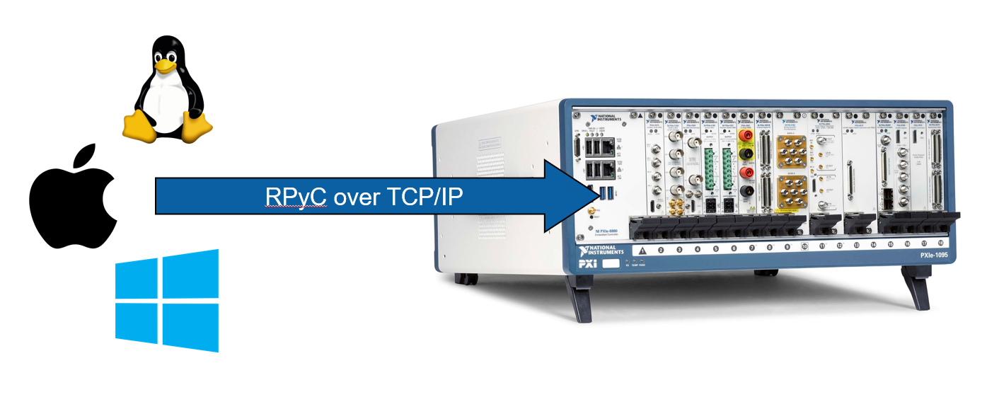
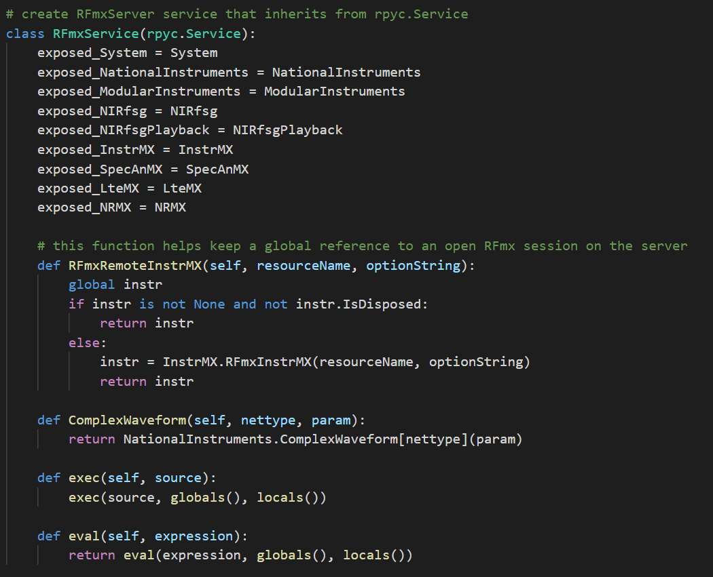
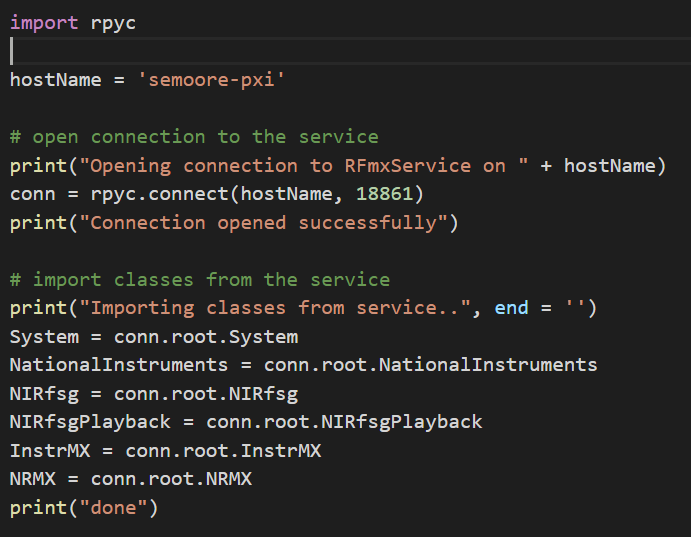
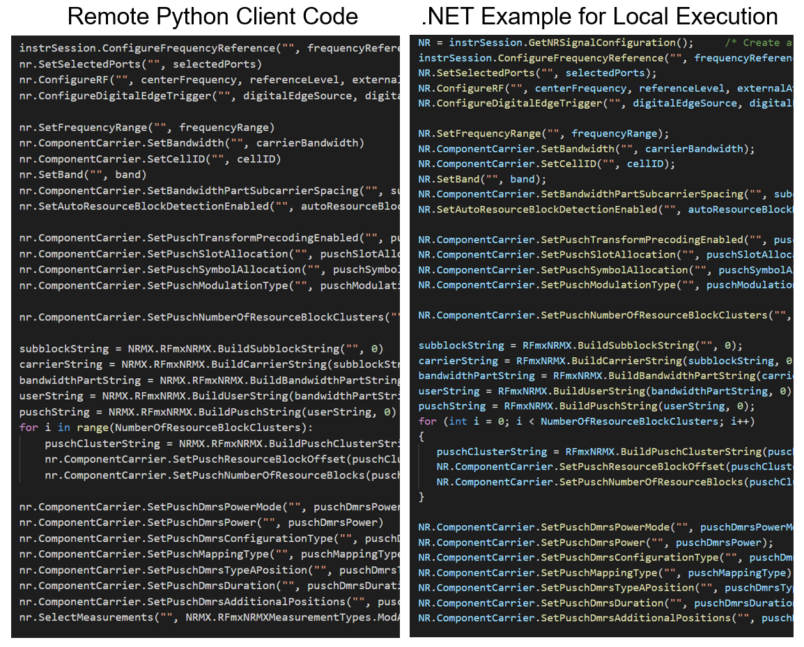

# Introduction
This project is an example of using [RPyC](https://rpyc.readthedocs.io/en/latest/) to make measurements in Python by calling into an RPyC server hosting NI software such as NI-RFmx and NI-RFSG.

# Demo Videos
[Click here to be redirected to YouTube](https://www.youtube.com/playlist?list=PLbtY6u-1ausYmZ_Sl47s6N2L9jWG4_aEm)

# Software
## Server
1. NI Software
    * NI-RFmx and personalities 3.0 or newer. The [Wireless Test Suite](https://www.ni.com/en-us/support/downloads/software-products/download.rfmx-cellular-bundle.html) installer 2019.01 contains all of these.
    * RFSA 18.2.1 or greater
    * RFSG 18.2.1 or greater
2. Python interpreter
    * The example was tested and developed using python 3.6
3. Python modules
    * RPyC
    * pythonnet: provides clr (Common Language Runtime)
4. Launch the server by running RFmxService.py

## Client
1. Python interpreter
    * The example was tested and developed using python 3.6
2. Python modules
    * RPyC
3. Run the examples in the client folder

# Hardware Setup
* All hardware is to be installed on the server.
* The examples require a vector signal generator and a vector signal analyzer.  The examples were tested and developed using an NI 5840 VST.

# Value Statement
Using Python, we can remotely execute NI instrument drivers running on a Windows system (PXIe controller for example) from a client that supports Python.

# Supported Clients
  * Windows
  * Macintosh
  * Linux
  * Any others that can run Python and RPyC

# How it Works
The server script imports the required libraries/modules for communicating with the instrument(s).

Next, the server script defines the RFmxService class. Instrument drivers are set as properties to expose to the client. Additional helper functions can also be defined.

Finally, the server script starts a new instance of a multi-threaded server using the RFmxService class definition. The server is ready to accept connection requests from clients.

Clients start by opening a connection to the server and getting the required instrument driver references. They are then ready to make driver calls. These calls are transported to the server for execution.

The client can program the instrument(s) just like they would if they were writing the code natively on the server. Remote communication and execution is transparent to the user.

Since the .NET driver is imported into Python, we have full instrument support out of the box for executing test sequences from the client.
