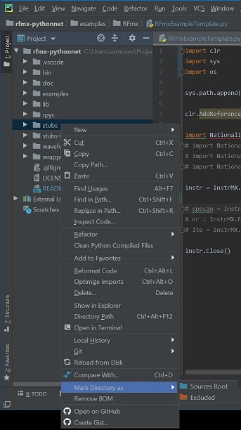

To enable code auto-completion, [configure your editor](https://github.com/gtalarico/ironpython-stubs/wiki) to use the stubs located in this directory. 

**Note:** All the python files in this directory use the .pyi extension, which was added in [PEP 484](https://www.python.org/dev/peps/pep-0484/#stub-files) (Python 3.5). For python versions less than 3.5, use the stubs located in the [stubs-legacy](https://github.com/NISystemsEngineering/rfmx-pythonnet/tree/master/stubs-legacy/) directory.

## Visual Studio Code
If you are using Visual Studio Code, a [settings file](https://github.com/NISystemsEngineering/rfmx-pythonnet/tree/master/.vscode) has already been provided. To use it, clone this repo then open the folder in VS Code. 

## PyCharm
If you are using PyCharm, mark the "stubs" directory as "Sources Root". PyCharm uses the source roots as the starting point for resolving imports.

## Known Limitations

Notable [known limitations](https://github.com/gtalarico/ironpython-stubs/wiki):
- Wildcard imports are not supported (`from x import *`)
- Since method overloads work differently in python, autocomplete options will look like `func(args)` or something similar

**Note:** The stubs require some additional modifications in order to expose all auto-complete options. Note that not all options will be available, especially as new versions are released. Always refer to the product documentation for a complete list of functionality.